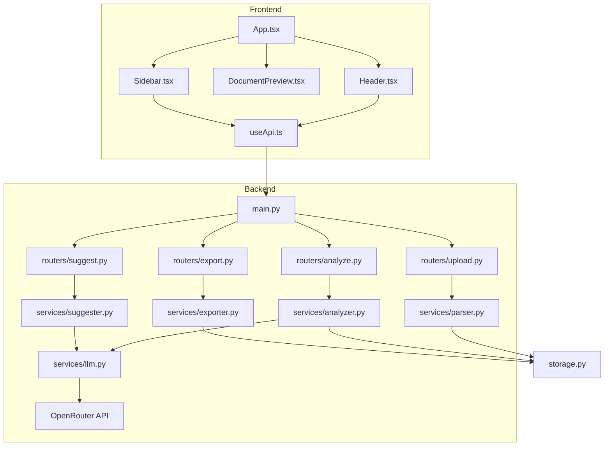

# Resume Refine

## Overview

AI-powered resume refinement app that analyzes resumes against job descriptions, identifies improvable sections, and provides inline suggestions with alternatives. Uses OpenRouter LLM for analysis and preserves original DOCX formatting on export.



## Repo Structure

```
├── backend/                          # FastAPI Python backend
│   ├── main.py                       # FastAPI app, CORS setup, router registration
│   ├── config.py                     # Environment config (API keys, upload dir)
│   ├── models.py                     # Pydantic models (ParsedDocument, Suggestion, Change)
│   ├── prompts.py                    # LLM system/user prompt templates
│   ├── storage.py                    # In-memory document storage
│   ├── routers/
│   │   ├── upload.py                 # POST /api/upload - Parse DOCX, store document
│   │   ├── analyze.py                # POST /api/analyze - Analyze resume vs job description
│   │   ├── suggest.py                # POST /api/suggest - Generate text alternatives
│   │   ├── export.py                 # POST /api/export - Apply changes, return DOCX
│   │   ├── document.py               # GET /api/document/{doc_id} - Serve original DOCX
│   │   └── chat.py                   # POST /api/chat - Chat agent with resume context
│   └── services/
│       ├── parser.py                 # Parse DOCX to text with position mapping
│       ├── analyzer.py               # Identify improvable sections via LLM
│       ├── suggester.py              # Generate 3 alternatives for selected text
│       ├── exporter.py               # Apply changes to DOCX preserving formatting
│       ├── chat.py                   # Handle chat conversations with LLM
│       └── llm.py                    # OpenRouter API wrapper
├── frontend/                         # React + TypeScript + Vite
│   ├── src/
│   │   ├── App.tsx                   # Main app state and 2-column layout
│   │   ├── types.ts                  # TypeScript interfaces
│   │   ├── main.tsx                  # React entry point
│   │   ├── components/
│   │   │   ├── Header.tsx            # Upload, Analyze, Export buttons + JD input
│   │   │   ├── DocumentPreview.tsx   # HTML preview via mammoth.js, real-time change highlighting
│   │   │   └── Sidebar.tsx           # Suggestions list + chat interface
│   │   └── hooks/
│   │       └── useApi.ts             # API client functions
│   ├── package.json                  # Dependencies and scripts
│   └── vite.config.ts                # Vite config with API proxy
├── requirements.txt                  # Backend Python dependencies
├── .env.example                      # Environment template
├── start.sh                          # Runs both backend and frontend
└── README.md                         # Project documentation
```

## How to Run / Test

**Environment setup:**
```bash
cp .env.example .env
# Add your OPENROUTER_API_KEY to .env
```

**Backend:**
```bash
cd backend
pip install -r ../requirements.txt
uvicorn main:app --reload --port 8000
```

**Frontend:**
```bash
cd frontend
npm install
npm run dev
```

**Both (convenience):**
```bash
./start.sh
```

**Build frontend:**
```bash
cd frontend
npm run build
```
